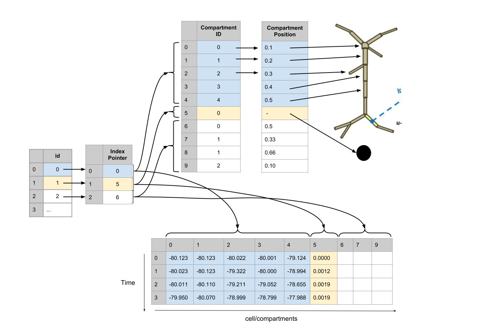

# nwbext_simulation_output: An extension for output data of large-scale simulations
 Developed in collaboration between the Soltesz lab and the Allen Institute during [NWB Hackathon #4](https://github.com/NeurodataWithoutBorders/nwb_hackathons/tree/master/HCK04_2018_Seattle/Projects/NetworkOutput) by Ben Dichter*, Kael Dai*, Aaron Milstein, Yazan Billeh, Andrew Tritt, Jean-Christophe Fillion-Robin, Anton Akhipov, Oliver Ruebel, Nicholas Cain, Kristofer Bouchard, and Ivan Soltesz

This extension defines a single NWB data type, `CompartmentSeries`, that allows you to store continuous data (e.g. membrane potential) from many compartments of many cells in a scalable way. 



This structure stores an arbitrarily large number of cells and cellular compartments with 5 datasets. It can scale to a million or more neurons, and enables efficient parallel read and write. It is designed to handle NEURON output data and to easily interface with the SONATA format.

## Guide
### python
#### installation
```
pip install git+https://github.com/bendichter/simulation_output.git
```

#### usage
```python
import pynwb
from nwbext_simulation_output.simulation_output import CompartmentSeries

nwbfile = pynwb.NWBFile(...)

...

membrane_potential = CompartmentSeries(name='membrane_potential',
                                       id=[1, 2, 3],
                                       index_pointer=[1, 2, 3],
                                       data=[[1., 2., 4.], [1., 2., 4.]],
                                       element_id=[0, 0, 0],
                                       compartment_position=[1., 1., 1.],
                                       unit='µV',
                                       rate=100.)
```

### MATLAB
#### installation

command line:
```
git clone https://github.com/bendichter/nwbext_simulation_output.git
```

in matlab:
```matlab
generateExtension('/path/to/nwbext_simulation_output/nwbext_simulation_output/nwbext_simulation_output.namespace.yaml');
```

#### usage
```matlab
membrane_potential = types.simulation_output.CompartmentSeries('gid', [1, 2, 3], ...
    'index_pointer', [1, 2, 3], ...
    'data', [[1., 2., 4.], [1., 2., 4.]]', ...
    'element_id', [0, 0, 0], ...
    'compartment_position', [1., 1., 1.], ...
    'data_unit', 'µV', ...
    'starting_time_rate', 100.);

nwb.acquisition.set('membrane_potential', membrane_potential);
```

## Talks
Ben Dichter*, Kael Dai*, Aaron Milstein, Yazan Billeh, Andrew Tritt, Jean-Christophe Fillion-Robin, Anton Akhipov, Oliver Ruebel, Nicholas Cain, Kristofer Bouchard, Ivan Soltesz. NWB extension for storing results of large-scale neural network simulations. NeuroInformatics. Montreal, Canada (2018). [video](https://www.youtube.com/watch?v=uuYQW0EE2GY).
